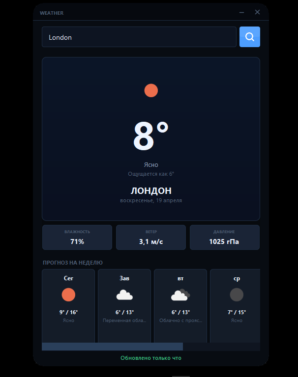

# ☀️ WeatherApp



[](https://adoptium.net/)
[](https://docs.oracle.com/javase/tutorial/uiswing/)
[](LICENSE)

Современное десктопное приложение погоды, написанное на **чистой Java + Swing** без сторонних UI‑фреймворков.  
Кастомный безрамочный тёмный интерфейс, плавные анимации, перетаскивание окна мышкой и данные в реальном времени из **OpenWeatherMap API**.

> 🎓 Это мой первый проект на GitHub и одна из первых работ на Java. Делал в учебных целях — чтобы разобраться с HTTP‑запросами, JSON и кастомной отрисовкой в Swing.

## ✨ Возможности

- 🌡️ **Текущая погода:** температура, ощущается как, влажность, скорость и направление ветра, атмосферное давление.
- 🎨 **Кастомный UI:**  
  - Безрамочное окно с закруглёнными углами.  
  - Перетаскивание окна мышкой (drag‑to‑move).  
  - Полностью тёмная минималистичная тема.
- 🌀 **Анимации:**  
  - Плавное появление данных (fade‑in).  
  - Эффект «тряски» при ошибке ввода или проблемах с сетью.
- 🖼️ **Иконки погоды** загружаются напрямую с CDN OpenWeatherMap и кешируются в памяти.
- 📦 **Минимум зависимостей** — ручной парсинг JSON и отрисовка через `Graphics2D`.

## 🚀 Быстрый старт

### 📋 Требования

- **JDK 17** или новее ([скачать](https://adoptium.net/))
- **Maven** 3.6+ (опционально, можно запустить напрямую в IDE)
- Бесплатный API‑ключ от [OpenWeatherMap](https://openweathermap.org/api)

### 🔧 Установка и настройка

1. **Склонируйте репозиторий:**
   ```bash
   git clone https://github.com/kyousukr/WeatherApp.git
   cd WeatherApp
   ```
2. Получите API‑ключ
Зарегистрируйтесь на OpenWeatherMap и создайте ключ в личном кабинете.
3.Укажите ключ в конфигурации (выберите один из способов):

Способ A — Через файл config.properties (рекомендуется):
Создайте в корне проекта файл config.properties и добавьте строку:

properties
openweathermap.api.key=ВАШ_КЛЮЧ_СЮДА
⚠️ Файл уже добавлен в .gitignore — вы случайно не зальёте ключ в публичный репозиторий.

Способ B — Через аргумент JVM:
При запуске передайте параметр:

bash
-Dweather.api.key=ВАШ_КЛЮЧ_СЮДА
Способ C — Временно в коде (только для отладки):
В классе WeatherApp найдите строку private static final String API_KEY и вставьте ключ. Не коммитьте это изменение!

▶️ Запуск
Через Maven:

bash
mvn clean compile
mvn exec:java -Dexec.mainClass="com.yourname.weather.WeatherApp"
Через IntelliJ IDEA / Eclipse:
Откройте проект как Maven‑проект и запустите главный класс WeatherApp.java.

📂 Структура проекта
text
WeatherApp/
├── pom.xml
├── README.md
├── .gitignore
├── config.properties.example   # Пример файла конфигурации
└── src/
    └── main/
        ├── java/com/yourname/weather/
        │   ├── WeatherApp.java      # Точка входа и весь UI
        │   └── WeatherService.java  # Логика работы с API
        └── resources/
            └── icons/
                └── search.png       # Иконка поиска
🛠️ Технические детали и планы
✅ Уже реализовано
Асинхронные HTTP‑запросы через HttpClient (Java 11+).

Ручной парсинг JSON (без внешних библиотек).

Обработка ошибок сети и некорректного ввода.

Кеширование иконок погоды в HashMap.

📌 Что будет улучшено
Подключение Gson для удобной работы с JSON.

Прогноз на 5 дней с почасовой детализацией.

История последних 5 запросов (выпадающий список).

Автоопределение города по IP/геолокации.

Возможность переключения единиц измерения (°C/°F, м/с / миль/ч).

Сборка в исполняемый .jar с помощью maven-assembly-plugin.

📄 Лицензия
Проект распространяется под лицензией MIT.
Вы можете свободно использовать, изменять и распространять код.

Сделано с ❤️ и ☕ в качестве первого шага в open‑source.

kyousukr
